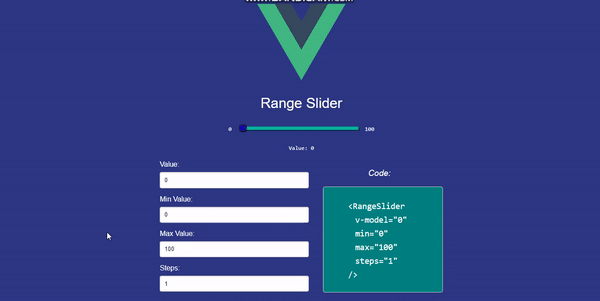

# Range Slider

A Vuejs 2.x html range slider. Feel free to copy the `<RangeSlider />` code and use the props properly

### How to

 1. Go to `src/components/SliderWrapper.vue` and copy the `<SlideRanger>` code with its pros
 2. Then navigate to `src/components/SlideRanger.vue` and study the code which is a html `input[type="range"]` element

### Demo:

### Props
| Prop Name | Prop Value (e.g.) | Prop Desription |
|--|--|--|
| v-model | 50 | the actual range slider value |
| min | 0 | min range value |
| max | 100 | max range value |
| steps | 2 | no of steps to skip between values |

> All the props are optional except the v-model